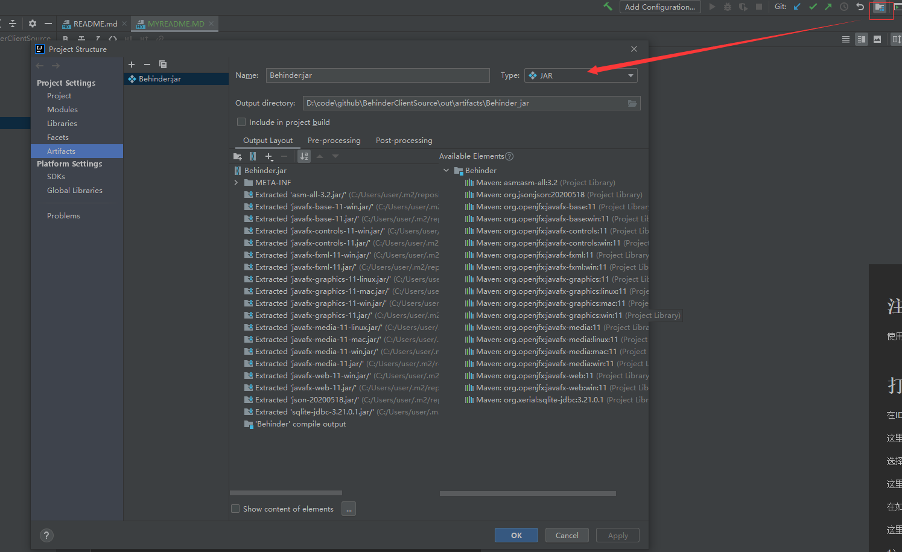
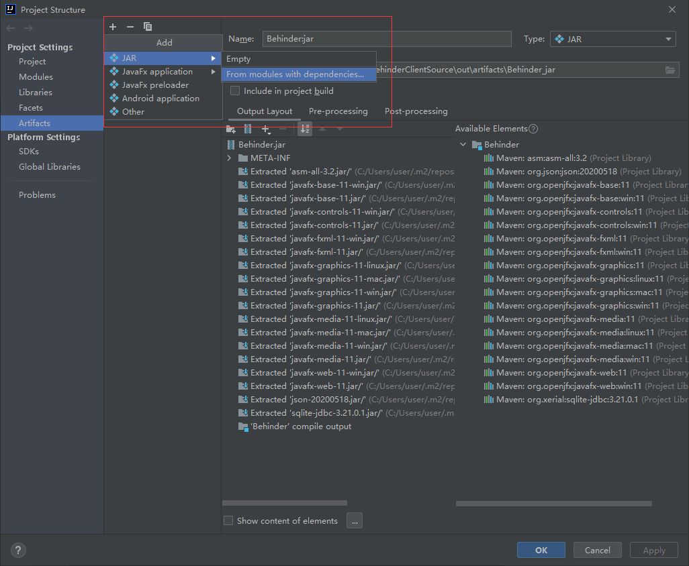
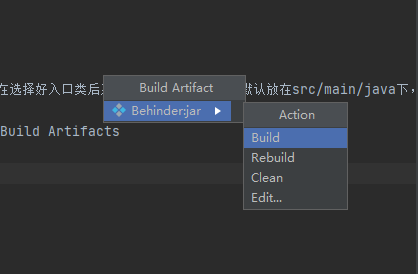

# 注意事项

使用jdk1.8，版本过高会出现错误

# 打包可执行jar

在IDEA的菜单中选择File–>Project Structure,如下图所示：

选择“Artifacts“在出现的图中点击加号

在如下的图形中需要注意两个地方：

1） 需要选择jar包默认运行的入口类
2） 需要设置MANIFEST.MF的位置，在选择好入口类后系统会将MANIFEST.MF默认放在src/main/java下，需要将其放在/src/main/resources下

到这里还没有结束，继续点击Build–>Build Artifacts

继续如下的操作

上述步骤后，你会在相应工程的目录下看到一个名称为out的文件夹。其中可以找到对应的jar文件